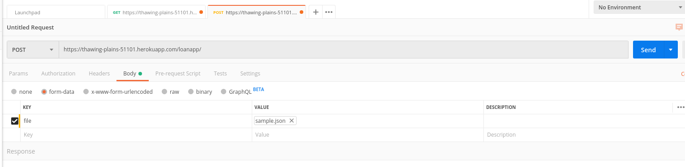
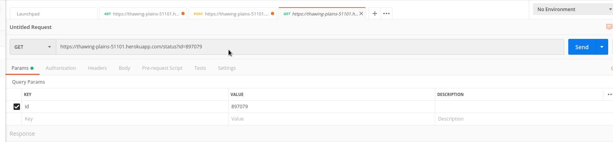

# loanapp
Camino Financial's Backend Take-home Challenge

URL for loanapp - https://thawing-plains-51101.herokuapp.com/loanapp/ (make note of the / after loanapp)

URL for status - https://thawing-plains-51101.herokuapp.com/status?id=1234

Sample loanapp endpoint request-

Sample status endpoint request-

To make requests to the loanapp endpoint, make sure that you send a POST request alongwith a .json file and specify the name of the file while making the request as 'file'.

To make requests to the status endpoint, make sure that you send a GET request alongwith a query string with the id of the loan application included.(For example, https:abcd.com/status?id=1234).

-------------------------------------------------------------------------------------------------------------------------------
Some assumptions

1. I have assumed that the filter ID given in the JSON file is the actual loan ID which will be used for querying.
2. To handle duplicate entries, I check the company name against the database. If the company has already applied for a loan, I simply update the values present in the database.
